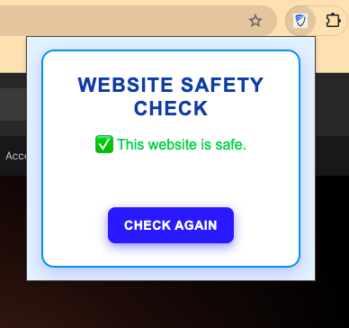
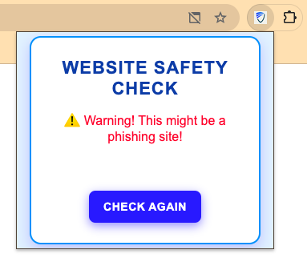
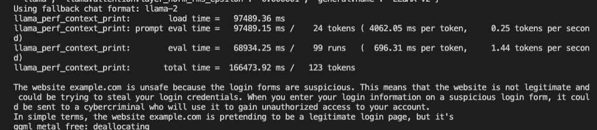
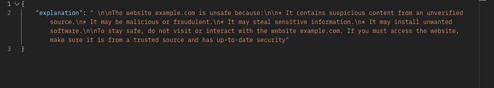

# ClickShield - Chrome Extension

🏆 ElleHacks'25 - TD Shoutout Winner | Recognized for Innovation in Cybersecurity and AI !

## Overview

**ClickShield** is a Google Chrome extension designed to help users identify phishing, fraud, or scam websites in real time. This extension leverages an AI-powered backend hosted via Flask, which provides personalized results on whether a website is safe or not. The core functionality is powered by **Google Safe Browsing API**, ensuring reliable data for web safety checks.

## Features

- **AI-Powered Explanations (LLaMA Model)** – Our Flask-based backend leverages a fine-tuned LLaMA (Large Language Model Meta AI) to generate detailed, contextual explanations about why a site may be unsafe.
- **Google Safe Browsing API Integration** - Uses Google’s extensive database to identify threats and determine whether a website is safe or malicious.
- **Text-to-Speech for Elderly Users** - This feature is tailored to help older adults who may find it challenging to identify unsafe websites. The extension reads out alerts and safety checks in an easily understandable way, promoting independence for elderly users.
- **Real-Time Website Scanning** – Automatically checks the current website for threats and alerts users instantly.
- **Easy to Use** – Seamlessly integrates with Chrome as a lightweight extension.

## Why This Project?

Elderly individuals are especially vulnerable to cybercrimes like phishing, fraud, and scams. In fact, according to a **2020 AARP study**, over **60% of older adults** have been victims of some type of online scam. With this extension, we aim to empower older people by making the web safer and more accessible, while reducing their dependency on others for such tasks.

By providing **text-to-speech capabilities**, we ensure that even users with limited technical knowledge can easily interact with the extension and make safer online decisions.

## Stats on Elderly Internet Vulnerability

- **60%** of older adults report being victims of online scams.
- **10%** of older adults have lost money due to phishing attacks.
- The average loss per scam is **$500** for elderly victims.


## How It Works

1. **Website Safety Check**: The extension continuously monitors the URL of the active tab and checks it against Google’s Safe Browsing API to identify any potential threats.
2. **AI-Powered Explanations**: Upon detecting a threat, the Flask AI model provides a detailed explanation of why the website is flagged as phishing, fraud, or scam in our backend.
3. **Text-to-Speech**: The extension reads out the safety message, ensuring that older adults understand the result without needing to read the text, making our extension accessible.

## Project Demo

URL: https://youtu.be/iqAYS1HcUPE

### Preview
- Chrome extension testing
  






- Llama model logs 



- Llama model testing on Postman




## Technologies Used

**Frontend & Extension Features**

- JavaScript, HTML/CSS (Chrome Extension) – Manages the extension's UI and interactions.
- Speech Synthesis API (Text-to-Speech) – Reads safety warnings out loud.

**Backend**
  
- Flask (Python) – Backend API for AI-generated explanations.
- LLaMA (Large Language Model Meta AI) – Pre-trained transformer model, fine-tuned to detect and explain phishing indicators.
- Google Safe Browsing API – Detects and verifies website threats.
  
**Testing & Debugging**
  
- Postman – Used for testing API calls to the Flask server, ensuring proper integration with Google Safe Browsing API and the LLaMA model for the backend.
  
## Installation and Usage

1. Clone this repository:  
   ```bash
   git clone <repo-url>
   ```

2. Navigate to the extension folder and open **chrome://extensions** in your browser.

3. Enable **Developer Mode** and click **Load Unpacked**.

4. Select the extension directory from your project folder.

5. The extension will now be available on your browser for testing!


